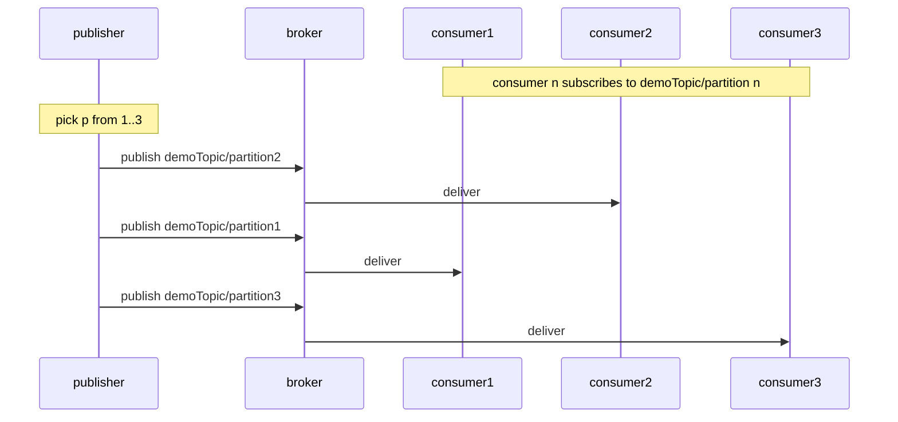
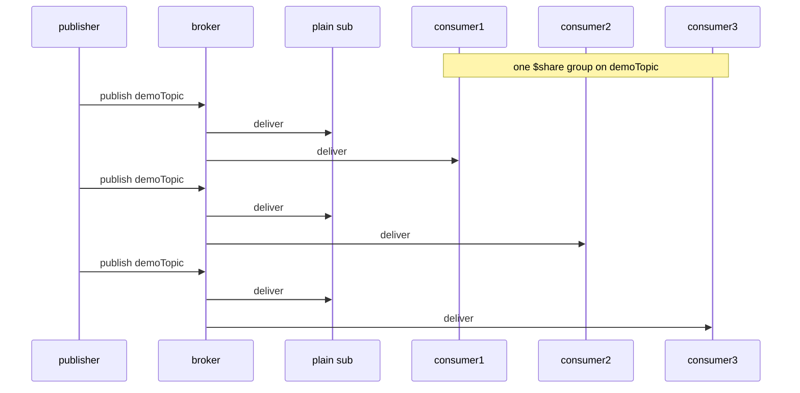

MQTT fans a topic out. Every client subscribed to it gets a copy of every
message. That is the point of the protocol, and most of the time it is what I
want too.

It is not what I wanted here. I had a Kafka consumer group in mind: several
consumers on one topic, the messages split between them, each one handled once.
I went looking for how to do that in MQTT.

The short answer is no on v3.1.1, which is what I was on. There is no consumer
group in the protocol. So the question turned into what to do
instead, and I found two answers and built both, in
[mqtt-client-load-balancing](https://github.com/ssupawat/mqtt-client-load-balancing),
one on a branch each.

## Partition the topic yourself

The first way needs nothing from the broker. It uses the topic hierarchy as the
partition key.

I picked three partitions. My publisher appends a partition number to the topic
on every message, chosen at random. Each consumer then subscribes to a single
partition. Every message still goes to exactly one subscriber, because no two
of them subscribe to the same topic.



This is roughly how Kafka partitions a topic. The difference is that in Kafka
the partition count is a property of the topic, held in one place. Here it is a
convention, and every publisher has to know it.

That is what makes the approach expensive. The partition count is baked into my
publishers, so the consumer count is too. I need one consumer per partition,
and the two counts move together. Scaling out is not a consumer-side change.
To go from three partitions to six, every device that publishes to the topic
has to start using the new range. On a fleet of devices in the field, that is
a rollout.

## Let the broker rotate

MQTT v5 has the same thing as a protocol feature. From
[HiveMQ](https://www.hivemq.com/blog/mqtt5-essentials-part7-shared-subscriptions/):

> In a standard MQTT subscription, each subscribing client is privy to a copy
> of each message broadcasted to that topic. With shared subscriptions, clients
> sharing a subscription in the same group receive messages in rotation, a
> process sometimes referred to as client load balancing. The message load of a
> single topic is distributed across all subscribers.

It is a prefix on the subscription:

```
$share/<group>/topic
```

`$share` marks it as shared, `<group>` names the group, and the rest is the
topic I want. Consumers that give the same group and the same topic form one
group. The broker delivers each message to one member of it.

Which member is the broker's business. The spec does not name an algorithm.
Mosquitto, which the demo runs on, goes round-robin. So the delivery is a
rotation. A consumer that is still busy gets its turn anyway.

A group does not change what anyone outside it sees. The demo keeps a couple of
subscribers on plain `demoTopic` to show it: they go on receiving every
message, while the three in the group split their own copy between them.



Scaling out is now what I wanted. I start another consumer, give it the same
group, and the broker starts including it in the rotation. Nothing on the
publishing side changes, because it never knew how many consumers there were.

The cost is a version floor. Shared subscriptions are v5. The prefix lives on
the subscribe side, so the consumers and the broker have to speak it.
Publishers are not in the way. That sounds like a small bill until someone asks
who is holding the versions.

## What it comes down to

Both approaches split the same stream. The difference is where the split is
decided.

Partitioning puts the decision in every publisher. The topology is then spread
across the fleet, and changing it means changing all of it. A shared
subscription puts the decision in the broker, and the publishers never learn
about it. That is why the consumer side can be resized on its own.

So MQTT has no consumer group on v3.1.1, and something close to one on v5.
That is the answer to the question I started with.

We never took it. v5 was out by then, but our devices had already shipped on
v3.1.1. The broker was not moving either. I no longer remember why. The devices
on their own would not have stopped us, since a publisher never sees the
prefix. The broker did.

So the shared subscription stayed a branch in this repository. Partitioning was
the only one of the two I could actually have used, at the price above: every
publisher in on the scheme, and a rollout to the fleet to change it.

Both branches run under Docker Compose, and the consumer logs show the split:
[github.com/ssupawat/mqtt-client-load-balancing](https://github.com/ssupawat/mqtt-client-load-balancing)

### References

- [StackOverflow: Is it possible to distribute reads of an MQTT topic over multiple consumers?](https://stackoverflow.com/questions/27850819/is-it-possible-to-distribute-reads-of-an-mqtt-topic-over-multiple-consumers)
- [HiveMQ: Shared Subscriptions in MQTT v5](https://www.hivemq.com/blog/mqtt5-essentials-part7-shared-subscriptions/)
