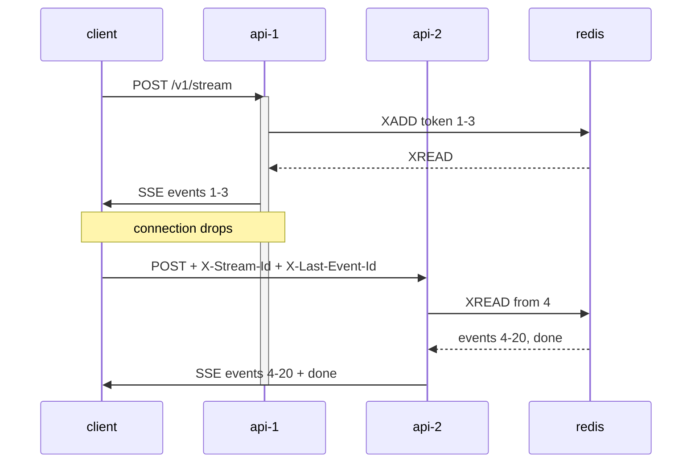

I got a chance to serve an [AG-UI](https://docs.ag-ui.com) endpoint. I started
where the protocol points. AG-UI's
[LangGraph integration](https://github.com/ag-ui-protocol/ag-ui/blob/main/integrations/langgraph/python/ag_ui_langgraph/endpoint.py)
ships a helper that registers the endpoint. It calls `@app.post(path)` and
returns a `StreamingResponse`. From there I wired it into my backend, and it
ran.

Then I started losing streams. About two minutes into a run, the stream would
stop. After that the client sat with half an answer.

My first guess was an idle timeout. Something in front was hanging up on a
stream that had gone quiet. The standard fix for that is a keepalive, because
it stops the connection from looking idle. So I added one. Even so, I still
lost the stream at two minutes.

So whatever sits in front counts the age of the connection. It hangs up at two
minutes, whether or not bytes are moving. Next I asked the infra team to raise
the limit, and they turned me down. In the end I never did learn which layer
sets that number.

That settled the shape of the problem. From then on, every run longer than two
minutes gets cut. And I have to survive it from my side.

Normally the browser would reconnect for me. `EventSource` does it for free.
First it retries on its own. Then it sends back a `Last-Event-ID` header. That
header names the last event the client saw. Then the server carries on from
there. But I could not use any of it. That machinery is GET only, and AG-UI
answers on POST. That puts me on `fetch` and a `ReadableStream`. Those will
stream a response. Even so, recovering one is my job.

The second wall came right behind the first. My endpoint runs on several pods.
Because of that, the retry goes through the load balancer. It lands
wherever it lands. If the half-finished run lives in the process that started
it, only that process can answer. Then I am back to pinning traffic with
sticky sessions.

So I needed two things. First, the work has to keep going after the client is
gone. Second, any pod has to be able to read a record of it.

I built [reconnectable-sse](https://github.com/ssupawat/reconnectable-sse) to
try it out. My production endpoint is Python. But this was a concept, and the
language was free. So I used it as an excuse to get familiar with Go. In the
end the shape is the part that matters.

It comes down to two lines:

```go
if !streamExists(r.Context(), key) {
    go runEventGenerator(streamID, string(body))
}

runSSEResponse(r.Context(), streamID, lastEventID, w, flusher)
```

I give `runSSEResponse` the request context. A disconnect stops it. That is
what I want, since there is nobody left to write to. Meanwhile
`runEventGenerator` gets `context.Background()`, and it keeps running. Hand it
the request context instead, and the disconnect kills the work itself. Then
nothing is left to come back to.



Resume then came down to an offset. Redis returns an entry id on every `XADD`.
That id goes out as the SSE `id`. Then the client sends it back on the retry.
From there it goes into `XREAD` as the starting point. That leaves no cursor
table and no bookkeeping. In the end the id the client is holding is the
offset.

I ran it. It does what I wanted. After a drop mid-stream, a client comes back
through a different pod and picks up where it stopped.

Still, I left edges in it. The generator starts under a check-then-act. So two
concurrent first requests with the same stream id can both start one. Also,
nothing cancels a generator whose client stays away. And I made the client
remember its last event id across the drop.

Design, endpoints, and how to run it: [github.com/ssupawat/reconnectable-sse](https://github.com/ssupawat/reconnectable-sse)
